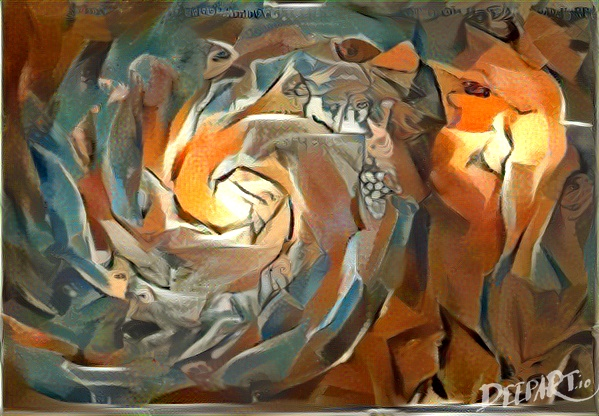
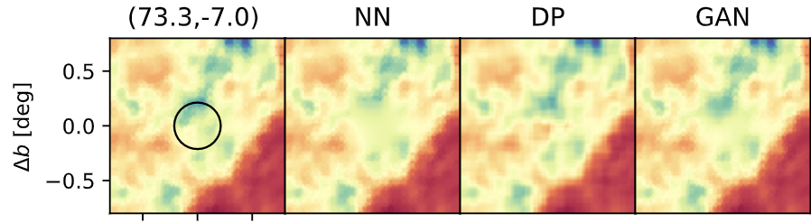

.. Python Inpainter for Cosmological and AStrophysical SOurces documentation master file, created by
   sphinx-quickstart on Wed Feb 26 15:16:30 2020.
   You can adapt this file completely to your liking, but it should at least
   contain the root `toctree` directive.

*******
PICASSO
*******

*Image of the*  `Whirlpool Galaxy <https://en.wikipedia.org/wiki/Whirlpool_Galaxy>`_  *(M51) rendered from the stylistics elements of* `Les Demoiselles d'Avignon <https://en.wikipedia.org/wiki/Les_Demoiselles_d%27Avignon>`_ *(Pablo Picasso, 1907) with* `<DeepArt.io>`_.

Python Inpainter for Cosmological and AStrophysical SOurces
===========================================================

This package  provides a suite of inpainting methodologies aimed at
reconstructing holes on images  (128x128 pixels) extracted from a HEALPIX map.

Three inpainting techniques are included in ``PICASSO`` and can be divided into two main groups:

1. diffusive-based methods (Nearest-Neighbours)
2. learning-based methods that rely on training DCNNs to fill the missing pixels with the predictions  learned from a training data-set (Deep-Prior and Generative Adversarial Networks, GAN ).

For further details see `Puglisi et al. (2020)  <http://arxiv.org/abs/2003.13691>`_.

So far,  ``PICASSO`` has been tested on  inpainting maps of   two   polarized emissions in the microwave regime: Synchrotron and Thermal Dust. GAN weights have been derived by training on  images of each emission and  can be found at : `GAN weights <https://drive.google.com/drive/folders/1NtJ-amLBXNjbvurMtbgptPdYmpp97do7>`_.

Install
#######

.. code-block:: bash

    git clone https://github.com/giuspugl/picasso
    cd picasso
    python setup.py install

Usage
#####

Scripts are provided to the user in order to perform:

- projection from full sky HEALPIX maps to flat thumbnails images `image_stacker   <https://github.com/giuspugl/picasso/blob/master/picasso/image_stacker_mpi.py>`_
- inpainting on GPUs `inpaint_gpu  <https://github.com/giuspugl/picasso/blob/master/picasso/inpaint_gpu.py>`_
- parallel inpainting on multiple processes (with ``mpi4py`` ) `inpaint_mpi <https://github.com/giuspugl/picasso/blob/master/picasso/inpaint_mpi.py>`_
- projection from flat images to HEALPIX  `inpaint_gpu  <https://github.com/giuspugl/picasso/blob/master/picasso/inpaint_gpu.py>`_

*An example of a crop images (leftmost panel) inpainted with the three methods in* ``PICASSO``.

Support
#######

If you encounter any difficulty in installing and using the code or you think
you found a bug, please `open an issue
<https://github.com/giuspugl/picasso/issues>`_.

Contents
########

.. toctree::
   :maxdepth: 2

   Inpainters

   utils

Indices and tables
==================

* :ref:`genindex`
* :ref:`modindex`
* :ref:`search`
